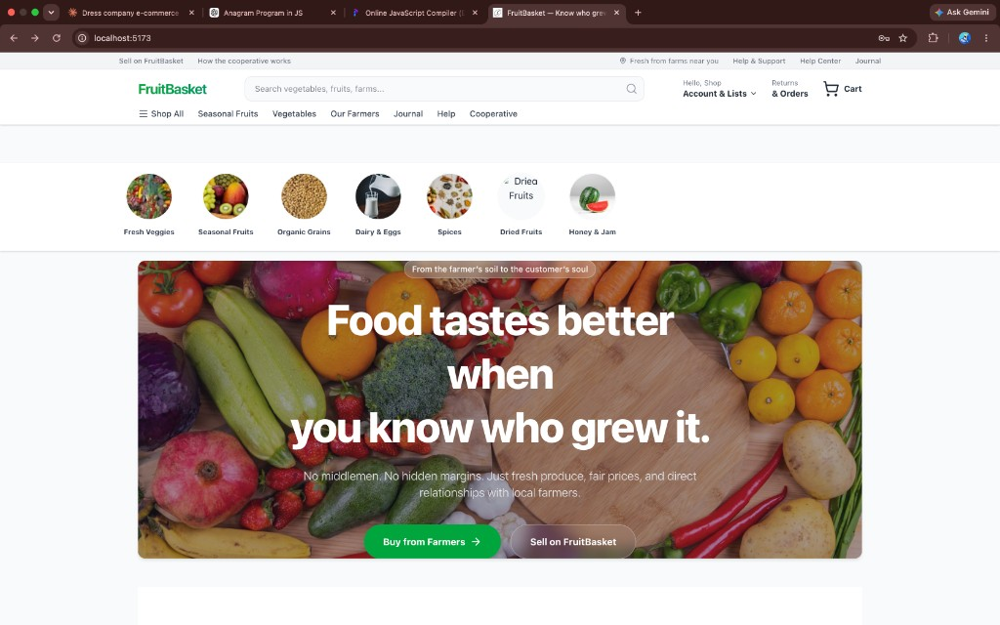
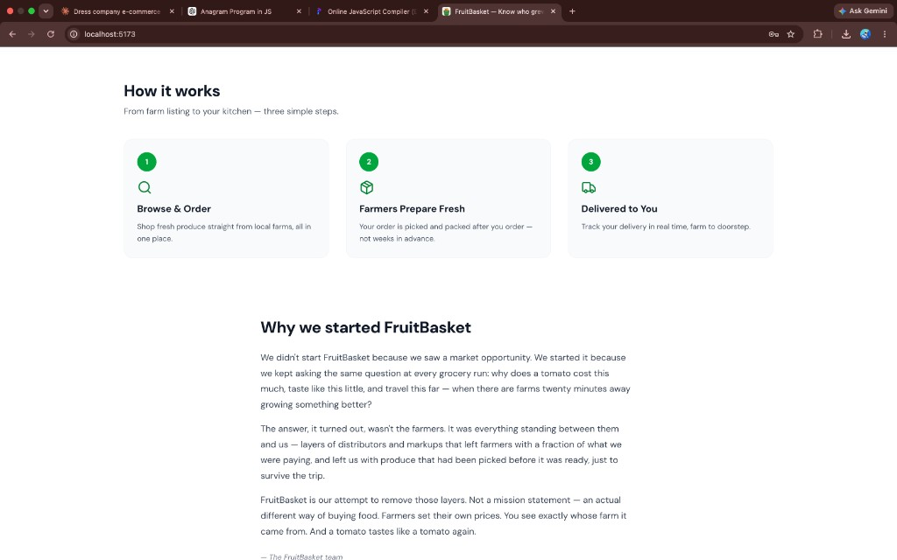
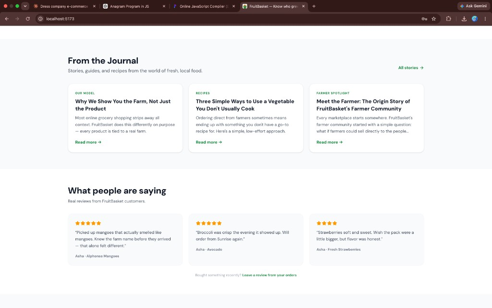
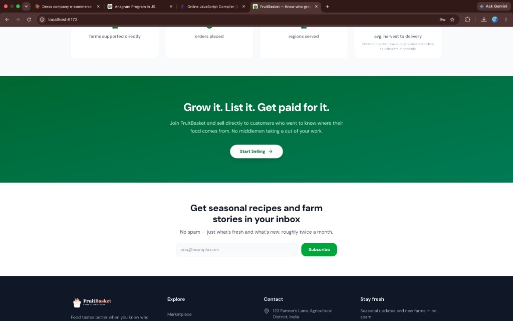
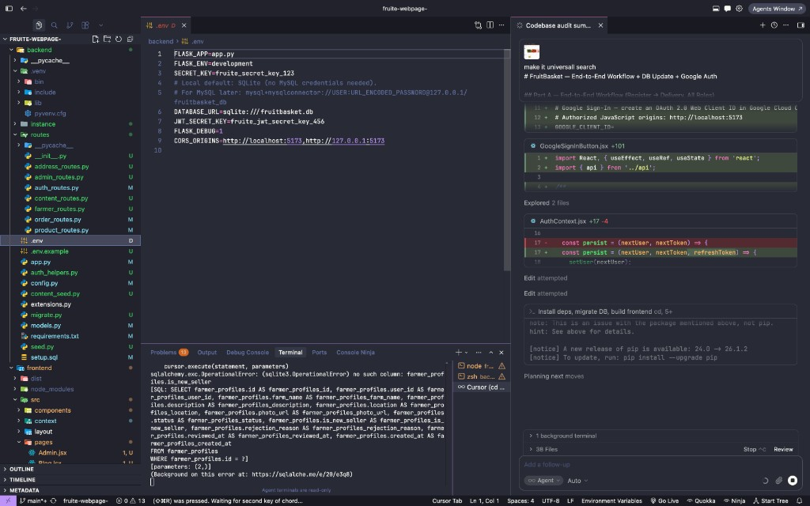
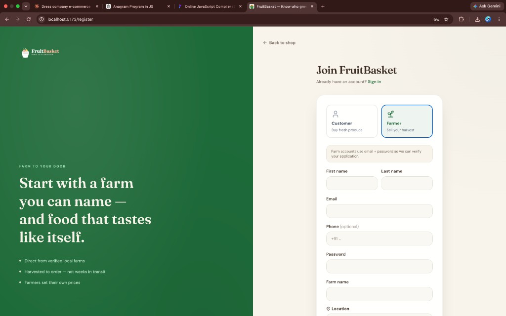
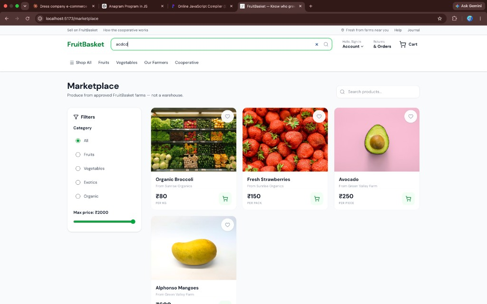
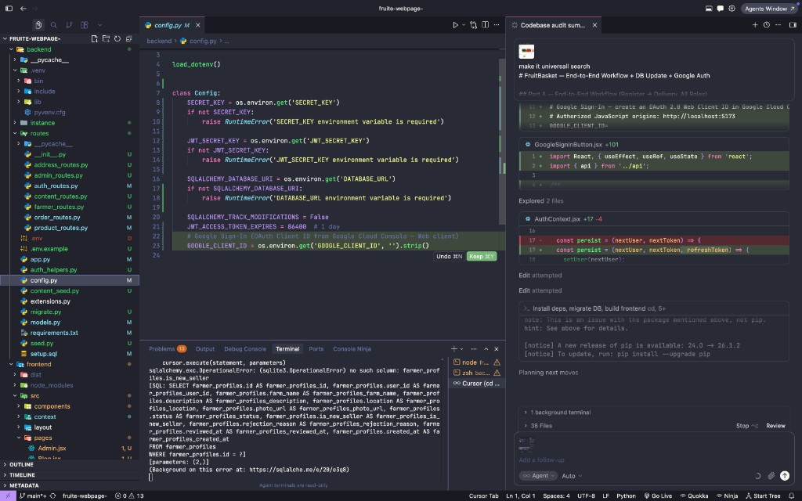

# FruitBasket — Multi-Farm Fresh Produce Marketplace

**Food tastes better when you know who grew it.**

FruitBasket is a full-stack multi-vendor marketplace: customers buy from approved local farms in one checkout; each farm fulfills only its own share of the order.

<p align="center">
  
</p>

---

## Screenshots

### Homepage storytelling
| Our story & how it works | Journal + testimonials |
|:---:|:---:|
|  |  |

| Impact + community band | Hero / marketplace chrome |
|:---:|:---:|
|  |  |

### Auth, farms & mobile
| Standalone register | Our farmers |
|:---:|:---:|
|  |  |

<p align="center">
  
  <br />
  <em>Marketplace — mobile layout</em>
</p>

---

## Stack

| Layer | Tech |
|-------|------|
| **Frontend** | React 19, Vite 7, Tailwind CSS 4, React Router 7 |
| **Backend** | Flask, SQLAlchemy, JWT, Bcrypt, Flask-Limiter |
| **Database** | MySQL (optional SQLite via `DB_ENGINE=sqlite`) |
| **Auth** | Email/password + Google Identity Services + OTP verify |

---

## Features

### Customers
- Browse marketplace, farms, and product detail (gallery images)
- Universal header search (products + farms)
- Multi-farm cart → one checkout → **per-farmer sub-orders**
- COD checkout (delivery fee applied server-side)
- Orders grouped by farm; request returns; leave reviews with photos
- Journal, Help center, newsletter signup

### Farmers
- Apply to sell → land in dashboard immediately (New Seller badge)
- Marketplace visibility after admin approval
- Products with **multi-image** gallery, stock, fulfillment statuses
- Returns queue (approve restores stock); cancel also restores stock

### Admins
- Approve / reject farm applications
- Flagged sellers queue (reactive low-rating flags + manual)
- Moderate pending reviews; manage returns
- Blog & Help CMS (create / edit / publish / delete)
- Live stats (orders, revenue, flags, pending reviews)

### Homepage
Hero → Trust → Categories → How it works → Our Story → Farm to door → Fresh this week → Meet a farmer → Journal (+ story best sellers) → Testimonials → Impact numbers → Community band (sell + newsletter)

---

## Quick start

### 1. Backend

```bash
cd backend
python3 -m venv .venv && source .venv/bin/activate
pip install -r requirements.txt
cp .env.example .env
```

Edit `.env` with MySQL credentials (shop-style, **not** `DATABASE_URL`):

```env
MYSQL_HOST=localhost
MYSQL_PORT=3306
MYSQL_USER=root
MYSQL_PASSWORD=your_password
MYSQL_DB=fruitbasket_db
SECRET_KEY=long-random-string
JWT_SECRET_KEY=another-long-random-string
FLASK_DEBUG=1
GOOGLE_CLIENT_ID=   # optional — see Google Auth below
```

```bash
# Create DB in MySQL, then:
python migrate.py
python seed.py
python app.py
# → http://127.0.0.1:5000
```

### 2. Frontend

```bash
cd frontend
npm install
cp .env.example .env   # optional
npm run dev
# → http://localhost:5173
```

| Variable | Purpose |
|----------|---------|
| `VITE_API_URL` | Backend base (default `http://localhost:5000`) |
| `VITE_GOOGLE_CLIENT_ID` | Same Web client ID as backend `GOOGLE_CLIENT_ID` |

### Demo accounts (after seed)

| Email | Password | Role |
|-------|----------|------|
| `admin@fruitbasket.com` | `admin123` | Admin |
| `customer@fruitbasket.com` | `customer123` | Customer |
| `ramesh@greenvalley.com` | `farmer123` | Farmer — Green Valley |
| `meera@sunrise.com` | `farmer123` | Farmer — Sunrise Organics |

---

## Google Sign-In (optional)

1. [Google Cloud Console](https://console.cloud.google.com/apis/credentials) → OAuth 2.0 Web client  
2. **Authorized JavaScript origins:** `http://localhost:5173`, `http://127.0.0.1:5173`  
3. Set `GOOGLE_CLIENT_ID` in `backend/.env` and `VITE_GOOGLE_CLIENT_ID` in `frontend/.env`  
4. Restart Flask and Vite  

Registration also supports **email or phone OTP** (in debug mode the code is shown in the UI / server log).

---

## Schema (order splitting)

```
Order  (one customer purchase)
 └── FarmerOrder  (per-farm sub-order + fulfillment status)
      └── OrderItem  (line → product, qty, price_at_purchase)
```

Also: `product_images`, `reviews` / `review_images`, `return_requests`, `seller_flags`, `auth_otps`, CMS tables (`blog_posts`, `help_articles`).

Source of truth: `backend/models.py` · bootstrap: `backend/setup.sql` · migrate: `python migrate.py`

---

## Project layout

```
fruite-webpage-/
├── backend/          # Flask API
│   ├── routes/       # auth, products, orders, farmer, admin, content, returns, reviews
│   ├── models.py
│   ├── seed.py
│   └── migrate.py
├── frontend/         # React SPA
│   └── src/
│       ├── pages/
│       ├── components/home/   # homepage sections
│       └── components/auth/   # login shell, Google, OTP
└── docs/screenshots/ # README images
```

---

## Security notes

- Never commit `backend/.env` — use `.env.example` only  
- Set `FLASK_DEBUG=0` outside local development  
- Rotate secrets if they were ever pushed to a remote  

---

## License

MIT
